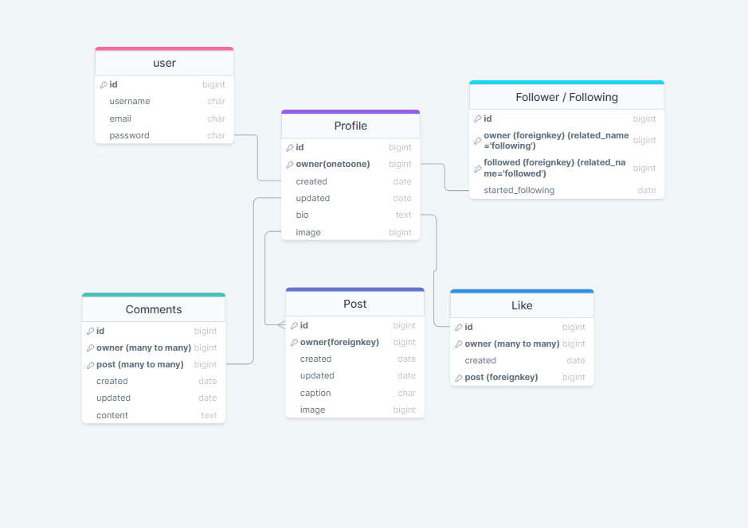

# Snap it API (Django Rest Framework)

* [**Project**](<#project>)
* [**Project Management**](<#project-management>)
* [**Wireframes**](<#wireframes>)
* [**User Experience UX**](<#user-experience-ux>)
* [**Features**](<#features>)
* [**Future Features**](<#future-features>)
* [**Testing**](<#testing>)
* [**Technologies Used**](<#technologies-used>)
* [**Bugs**](<#bugs>)
* [**Unfixed Bugs**](<#unfixed-bugs>)
* [**Deployment**](<#deployment>)
* [**Credits**](<#credits>)
* [**Acknowledgement**](<#acknowledgement>)

# Project
Welcome to Snap it's API. This API is the connection between the front-end and the back-end of the Snap it application. The API is created with Django REST Framework. 

[Front-end live link](https://front-end-react.herokuapp.com/)
 

[Front-end repository](https://github.com/frirsta/react-front-end)

The front-end application is connected to Snap it's API.

[Back-end API repository](https://github.com/frirsta/drf-api-react)
 

[Back-end API deployment](https://drf-api-frirsta.herokuapp.com/)

 

 

# Project

 

# Project Management

 

# Database model
 

 

# Features

 

# Future Features

 

# Testing
## [Python Validation](https://pep8ci.herokuapp.com/)
The code passed the pep8 validation.
There were 4 small errors found in the settings.py that cannot be fixed and there is no need for them to be fixed.

 
 

 

# Technologies used
* Python - For functionality of the website
* Django - Model-View-Template framework
Git 
* GitHub - Used to host the website
* GitPod - For deployment of the website
* [Miro](https://miro.com/) - For creating the Wireframes

 

django-admin startproject PROJ_NAME .
djangorestframework django-cors-headers
pip freeze > requirements.txt
django-admin startproject name .
pip install django-filter
pip install dj-rest-auth
pip install 'dj-rest-auth[with_social]'
pip install djangorestframework-simplejwt
pip install djangorestframework
pip install django-cloudinary-storage
pip install Pillow
pip install ‘django<4’
pip install "django-phonenumber-field[phonenumberslite]"
pip3 install dj_database_url==0.5.0 psycopg2
pip3 install gunicorn django-cors-headers
pip install django-rest-auth[with_social]

SQLite

pip3 install dj-rest-auth==2.1.9

pip freeze --local > requirements.txt

 

# Database/Hosting
* Heroku - The platform where the application is deployed
Gunicorn
Cloudinary
Pillow
Psycopg2
PostgreSQL
PyJWT

# Bugs

 

# Unfixed Bugs

 

# Deployment

This website was deployed to [Heroku](https://heroku.com/). To deploy the website follow the steps below:

1. Log in or create an account on heroku.

2. On the heroku Website click 'New' and after click 'Create new app'.

3. Write the app name, choose a region and then click 'Create app'. 

4. In the application website click 'Deploy' on the navigation menu.

5.  In the 'Deploy' page, click the GitHub logo. Search for the GitHub repository that was made for this project.

6. Search for the GitHub repository that was made for this project.

7. When the repository is found click 'Connect'.

8. Scroll down to manual deploy and make sure you have chosen the main branch.

9. Click deploy.

 

# Credits
<a href="https://www.flaticon.com/free-icons/user" title="user icons">User icons created by Freepik - Flaticon</a>
<a href="https://www.flaticon.com/free-icons/picture" title="picture icons">Picture icons created by Chanut - Flaticon</a>
https://www.django-rest-framework.org/api-guide/filtering/#searchfilter
<a href="https://www.flaticon.com/free-icons/creation" title="creation icons">Creation icons created by Freepik - Flaticon</a>

 

# Acknowledgement
