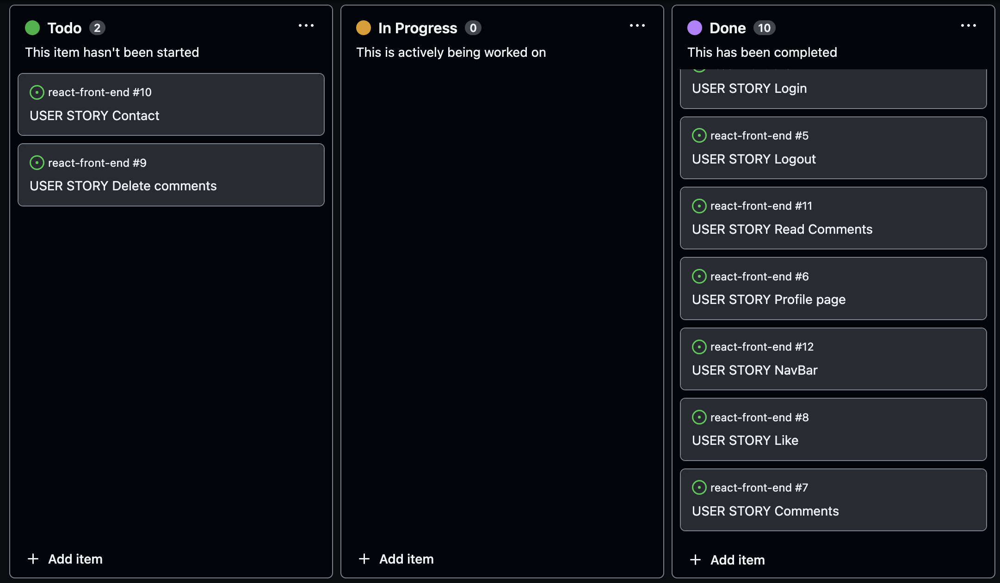

# Snap it API (Django Rest Framework)

* [**Project**](<#project>)
* [**Project Management**](<#project-management>)
* [**Database model**](<#database-model>)
* [**API endpoints**](<#api-endpoints>)
* [**Future Features**](<#future-features>)
* [**Testing**](<#testing>)
* [**Technologies Used**](<#technologies-used>)
* [**Bugs**](<#bugs>)
* [**Deployment**](<#deployment>)
* [**Credits**](<#credits>)
* [**Acknowledgement**](<#acknowledgement>)

# Project
Welcome to Snap it's API. This API is the connection between the front-end and the back-end of the Snap it application. The API is created with Django REST Framework. 

[Front-end live link](https://front-end-react.herokuapp.com/)
 

[Front-end repository](https://github.com/frirsta/react-front-end)

The front-end application is connected to Snap it's API.

[Back-end API repository](https://github.com/frirsta/drf-api-react)
 

[Back-end API deployment](https://drf-api-frirsta.herokuapp.com/)

 

# Project Management
I have used the agile methodology for the API and the front-end.

## Agile methodology

I have used github issues to work with Snap it. They have been prioritized by four different labels.
 

- Must Have - Are the issues that have to be top priority.
- Should have - Are second priority.
- Could have - Third priority.
- Won't have - Is what will not be in the project.

The Won't have label is for long term use in the project and has not been used in this project.

GitHub Issues
 

 

I have used the github project board to work with Snap it.
 

 

 

# Database model
 

 

# API Endpoints
 

Accounts:
 
Endpoint:/accounts/
 
Endpoint:/accounts/int:pk/

 

Business:
 
Endpoint:/business/
 
Endpoint:/business/int:pk/

 

Comments:
 
Endpoint:/comments/int:pk/
 
Endpoint:/comments/

 

Contact:
 
Endpoint:/contact/
 
Endpoint:/contact/int:pk/

 

Followers:
 
Endpoint:/followers/
 
Endpoint:/followers/int:pk/

 

Likes:
 
Endpoint:/likes/
 
Endpoint:/likes/int:pk/

 

Posts:
 
Endpoint:/posts/
 
Endpoint:/posts/int:pk/

 

Saved Posts:
 
Endpoint:/saved/
 
Endpoint:/saved/int:pk/

 

# Future Features

 

# Testing
## [Python Validation](https://pep8ci.herokuapp.com/)

 

## Manual testing
Testing | Steps | Expected | Results | Pass/Fail |
--- | --- | --- | --- | ---
Account: ListAPIView, RetrieveUpdateAPIView | Go to endpoint:accounts/ and endpoint:accounts/<int:pk> | 1. In endpoint:accounts/ a list of account objects displayed in a list.   2. In endpoint:accounts/<int:pk> a specific accounts object details is displayed and if the owner of the account is in their account detail page they can write/change their bio and add/change their profile image | 1. In endpoint:accounts/ a list of account objects displayed in a list.   2. In endpoint:accounts/<int:pk> a specific accounts object details is displayed and if the owner of the account is in their account detail page they can write/change their bio and add/change their profile image | Success
Business: ListCreateAPIView, RetrieveUpdateAPIView | Go to endpoint:business/ 1. Create a business account.  Go to endpoint:business/<int:pk> | 1. In endpoint:business/ a list of business objects displayed in a list. A form is displayed where a user can create a business account.   2. In endpoint:business/<int:pk> a specific business object details is displayed and if the owner of the business account is in their business account detail page they can write/change their business name, description, phone number and business profile image. | 1. In endpoint:business/ a list of business objects displayed in a list. A form is displayed where a user can create a business account.   2. In endpoint:business/<int:pk> a specific business object details is displayed and if the owner of the business account is in their business account detail page they can write/change their business name, description, phone number and business profile image.| Success
Comments: ListCreateAPIView, RetrieveUpdateDestroyAPIView | Go to endpoint:comments/ 1. Create a comment.  Go to endpoint:comments/<int:pk>  1. Edit comment.   2. Delete comment. | 1. In endpoint:comments/ a list of comments objects displayed in a list. A form is displayed where a user can create a comment.   2. At endpoint:comments/<int:pk> a specific comments object details are displayed and if the owner of the comments is in their comments detail page they can write/change their comments and delete their comments | 1. In endpoint:comments/ a list of comments objects displayed in a list. A form is displayed where a user can create a comment.   2. At endpoint:comments/<int:pk> a specific comments object details are displayed and if the owner of the comments is in their comments detail page they can write/change their comments and delete their comments | Success
Contact: ListCreateAPIView, RetrieveUpdateDestroyAPIView | Go to endpoint:contact/ type a message and go to endpoint:contact/<int:pk> | 1. In endpoint:contact/ a list of contact objects displayed in a list. A form is displayed where a user can create a contact object   2. In endpoint:contact/<int:pk> a specific contact object details is displayed and if the owner of the contact object is in their contact detail page they can write/change their message and delete their message |   1. In endpoint:contact/ a list of contact objects displayed in a list. A form is displayed where a user can create a contact object   2. In endpoint:contact/<int:pk> a specific contact object details is displayed and if the owner of the contact object is in their contact detail page they can write/change their message and delete their message | Success
Followers: ListCreateAPIView, RetrieveDestroyAPIView | Go to endpoint:followers/  1. Start following an account.   Go to endpoint:followers/<int:pk>   1. Delete follow object (unfollow). | 1. In endpoint:followers/ a list of followers objects are displayed in a list. A drop-down menu with all the accounts is displayed where a user can start following another account.   2. In endpoint:followers/<int:pk> a specific follower object details is displayed and if the owner of the followers object is in their followers detail page they can delete that follow (unfollow an account) | 1. In endpoint:followers/ a list of followers objects are displayed in a list. A drop-down menu with all the accounts is displayed where a user can start following another account.   2. In endpoint:followers/<int:pk> a specific follower object details is displayed and if the owner of the followers object is in their followers detail page they can delete that follow (unfollow an account) | Success
Likes: ListCreateAPIView, RetrieveDestroyAPIView | Go to endpoint:likes/  1. Like a post    Go to endpoint:likes/<int:pk>   1. Delete like object | 1. In endpoint:likes/ a list of posts objects that are liked by an account are displayed. A drop-down menu with all the posts is displayed where a user can like a post.   2. In endpoint:likes/<int:pk> a specific like object details is displayed and if the owner of the like is in their likes detail page they can delete that like | 1. In endpoint:likes/ a list of posts objects that are liked by an account are displayed. A drop-down menu with all the posts is displayed where a user can like a post.   2. In endpoint:likes/<int:pk> a specific like object details is displayed and if the owner of the like is in their likes detail page they can delete that like | Success
Posts: ListCreateAPIView, RetrieveUpdateDestroyAPIView | Go to endpoint:posts/ 1. Create a post by writing a caption and uploading an image.  Go to endpoint:posts/<int:pk> 1. Change caption   2. Change image   3. Delete the post | 1. In endpoint:posts/ a list of posts objects are displayed. A form is displayed where a user can create a post, by writing a caption and uploading an image.    2. In endpoint:posts/<int:pk> a specific post object details is displayed and if the owner of the post is in their posts detail page they can change the caption, change posted images and delete that post | 1. In endpoint:posts/ a list of posts objects are displayed. A form is displayed where a user can create a post, by writing a caption and uploading an image.    2. In endpoint:posts/<int:pk> a specific post object details is displayed and if the owner of the post is in their posts detail page they can change the caption, change posted images and delete that post | Success
Saved posts: ListCreateAPIView, RetrieveDestroyAPIView | Go to endpoint:saved/  1. Save a post    Go to endpoint:saved/<int:pk>   1. In endpoint:saved/ a list of saved posts objects is displayed. A drop-down menu with all the posts is displayed where a user can save a post.   2. In endpoint:saved/<int:pk> a specific saved post object details is displayed and if the owner of the saved post is in their saved posts detail page they can delete that saved post object.| 1. In endpoint:saved/ a list of saved posts objects is displayed. A drop-down menu with all the posts is displayed where a user can save a post.   2. In endpoint:saved/<int:pk> a specific saved post object details is displayed and if the owner of the saved post is in their saved posts detail page they can delete that saved post object. | Success

 

The code passed the pep8 validation.
There were 4 small errors found in the settings.py that cannot be fixed and there is no need for them to be fixed.

 
 

 

# Technologies used
* [Python](https://www.python.org/) - For functionality of the website
* [Django](https://www.djangoproject.com/) - Python framework for fast development and clean design.
* [Django REST Framework](https://www.django-rest-framework.org/) - A toolkit for building Web APIs.
* [Git](https://git-scm.com/) - Version control 
* [GitHub](https://github.com/) - Used to host the website
* [GitPod](https://www.gitpod.io/) - For deployment of the website
* [Miro](https://miro.com/) - For creating the Wireframes
* [Heroku](heroku.com) - The platform where the application is deployed.

 

## Libraries and other resources
 * [Django AllAuth](https://django-allauth.readthedocs.io/en/latest/) Authentication, registration, account management and 3rd party account authentication.
 * [Django Cloudinary Storage](https://pypi.org/project/django-cloudinary-storage/) Provides Cloudinary storages for media and static files.
 * [Django Cors Headers](https://pypi.org/project/django-cors-headers/) Is an application for handling the server headers required for Cross-Origin Resources Sharing
 * [Django filter](https://django-filter.readthedocs.io/en/stable/) Allows user to filter down a queryset based on a model's fields, displaying the form to let them do this.
 * [dj-rest-auth](https://dj-rest-auth.readthedocs.io/en/latest/) Provides a set of REST API endpoints, to handle user registration and authentication tasks.
 * [dj-rest-auth with_social](https://dj-rest-auth.readthedocs.io/en/latest/installation.html#social-authentication-optional) Provides classes for creating a social media authentication view.
 * [djangorestframework-simplejwt](https://pypi.org/project/djangorestframework-simplejwt/) JSON Web Token authentication plugin for Django REST Framework.
 * [Django phonenumber field](https://django-phonenumber-field.readthedocs.io/en/latest/index.html) Validate and convert phone numbers.
 * [Dj database URL](https://pypi.org/project/dj-database-url/) Use Database URLs in Django Application.
 * [gunicorn](https://gunicorn.org/) Allows to run Python applications by running multiple Python processes within a single dyno.
 * [Pillow](https://pypi.org/project/Pillow/) Imaging Library.
 * [PostgreSQL](https://www.elephantsql.com/) Databases.
 * [Psycopg2](https://pypi.org/project/psycopg2/) Python PostgreSQL Database Adapter.
 * [PyJWT](https://pyjwt.readthedocs.io/en/stable/) Encode and decode JSON Web Tokens.

 

# Bugs

 

# Deployment

This website was deployed to [Heroku](https://heroku.com/). To deploy the website follow the steps below:

1. Log in or create an account on heroku.

2. On the heroku Website click 'New' and after click 'Create new app'.

3. Write the app name, choose a region and then click 'Create app'. 

4. In the application website click 'Deploy' on the navigation menu.

5.  In the 'Deploy' page, click the GitHub logo. Search for the GitHub repository that was made for this project.

6. Search for the GitHub repository that was made for this project.

7. When the repository is found click 'Connect'.

8. Scroll down to manual deploy and make sure you have chosen the main branch.

9. Click deploy.

 

# Cloning

1. Open the GitHub repository. 

2. Click the green 'Code' button and copy the given URL.

3. Open Git Bash and change directory to where you want the cloned directory.

4. Write: 
<pre>
"git clone"
</pre> 
, and paste the URL that was copied in Github and then click 'enter'.

 

5. In Git Bash locate the cloned directory.

6. Type:
<pre> "code ."
</pre>
This will launch the project in VSCode.

 

7. Now install the requirements needed to run the project by typing this command: 
<pre>
"pip3 install -r requirements.txt".
</pre>

 

8. Create an 'env.py' file in the top level directory. Add the following code and their values:
<pre>
import os

os.environ['CLOUDINARY_URL'] = 'your cloudinary url'
os.environ['DATABASE_URL'] = 'your database url'
os.environ['SECRET_KEY'] = 'your secret key'
</pre>

 

9. Add the variables from the env.py file in Herokus Config Vars when it is time for deployment.

10. Now run this command:
<pre>
"python manage.py migrate"
</pre> 

11. Run this command:
<pre>
"python manage.py runserver"
</pre>

If everything is working as expected the project will launch and be ready for development.

# Credits

Sources that have helped build the website:

[Django REST Framework documentation](https://www.django-rest-framework.org/)

[Stack Overflow](https://stackoverflow.com/)

Default profile image:
<a href="https://www.flaticon.com/free-icons/user" title="user icons">User icons created by Freepik - Flaticon</a>

Default post image:
<a href="https://www.flaticon.com/free-icons/picture" title="picture icons">Picture icons created by Chanut - Flaticon</a>

 

# Acknowledgement
This website has been made for my 5th Portfolio Project (Advanced Front-end) - Diploma in Full Stack Software Development at [Code Institute](https://codeinstitute.net/).
I would like to thank my mentor Gareth McGirr from Code Institute who helped me develop the website with feedback through the project.